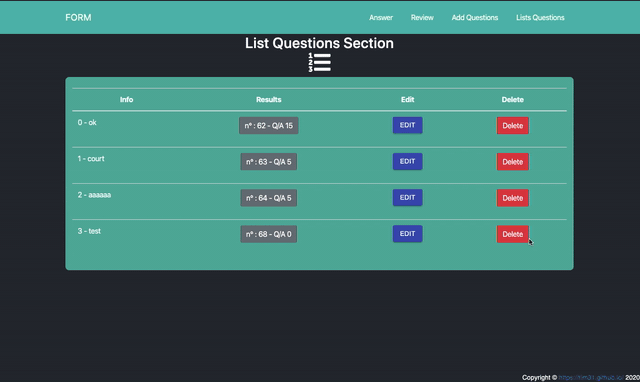

# Form - Questions / Answers :  website

Admin : 
- insert question(json format)
- edit your questions
Client :
- answers 
- reviews your answers and questions





# TypeScript, React and Express Starter Project

A template project where there's a start for React as a front-end and Express as a back-end, all with TypeScript.

Some buzzwords:

- React
- TypeScript
- Babel
- Webpack
- Yarn Workspaces
- Hot Reload

## Usage

This requires Yarn to work.

### Install


# Start the project 

## 1. installation

## 1.1. Database

PostgresSQl required
in the postgres terminal

```
CREATE DATABASE tsp;

c\ tsp

CREATE TABLE table_answer
(
  answer_id serial PRIMARY KEY,
  info VARCHAR(255),
  description TEXT[]
);

CREATE TABLE table_question
(
  question_id serial PRIMARY KEY,
  info VARCHAR(255),
  description TEXT[]
);
```

## 1.1.1. create .env 

```
DB_PWD=root
PORT_PROD=42
PORT_DEV=42
PATH_PREFIX_PROD=/example
REACT_SERVER=http://localhost:4242
```

DB_PWD : your password for the postres db
change the rest as you want 

## 1.2. run project

### 1.2.1. installation
```
git clone [...]
cd [...]
yarn install 
```
it should install node_modules in your project

### 1.2.2 start - http://localhost:8080
```
yarn start
```
This starts _two_ servers on localhost, on ports 8080 and 8081. 
Open http://localhost:8080 to serve the files from `/frontend` - React and all that. 
http://localhost:8081 is where the `/server` stuff is, i.e. Express.


If it doesn't work delete all folders node_modules and run `yarn install`in folder `server` and `frontend`


Start with installing all requried dependencies, and creating all appropriate symlinks between dependencies

```console
$ yarn
```

### Development Mode

To start development mode:

```console
$ yarn start
```

This starts _two_ servers on localhost, on ports 8080 and 8081. Open http://localhost:8080 to serve the files from `/frontend` - React and all that. localhost:8081 is where the `/server` stuff is, i.e. Express.

### Testing

To run all tests in the project, you can simply run

```console
$ yarn test
```

### Production Build

To package everything into a production ready bundle, run:

```console
$ yarn build        # this compiles everything into dist/
$ yarn start:build  # this will launch the express server in production mode on port 80
```

Production mode differs from Development Mode in the way that there is only one server: Express. This serves the React file directly from http://localhost/ root (note, the default HTTP port: 80). All REST paths are moved to a prefix of `/api`, on the same server.

All this happens automatically by the configurations.

## General Notes

The one/two servers difference is only to make the setup of the project as (technically) simple as possible, while suitable for as many as possible. You should be able to start using any of the three, together or separately, with minimal reconfiguration required.
